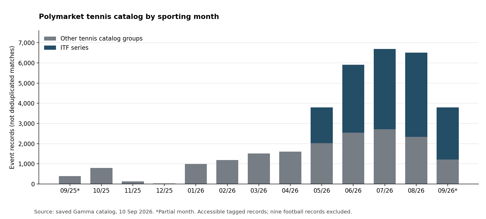

# Tennis data and Polymarket coverage

**Tennis data is available at many levels, but none of the datasets audited here is demonstrated to cover the full Polymarket tennis universe with reliable sporting labels, historical prices, executable depth, and sufficient reuse rights.** The important discovery is the breadth of the market: ITF, Challenger, qualifying, doubles, special formats and non-match questions are part of the observed catalog. Treating tennis as a collection of ATP/WTA main-tour singles results would miss much of that universe.

This is an evidence audit, not an approved architecture, procurement decision or roadmap. The research window is **10 September 2025 through 10 September 2026**; sources and public payloads were checked on 10 September 2026. Older downloaded files are labeled as older snapshots. Paid databases and private archives are included, with documentation claims separated from data actually inspected.

## Reports and source catalog

| Read | What it answers |
|---|---|
| [Polymarket census](polymarket-census.md) | Which event families and contracts exist, how the inventory changes, and defects in the market metadata |
| [Competition and event-family inventory](polymarket-competition-inventory.md) | Observed league/title groups, counts, date ranges and direct example links |
| [Public tennis data](public-tennis-data.md) | Downloadable results, rankings, stats, points, official archives and contextual data; measured payload quality |
| [Commercial and private data](commercial-tennis-data.md) | Official rights chains, APIs, specialist databases, tracking archives, costs and access restrictions |
| [Historical market data and odds](market-history-and-odds.md) | Polymarket price/trade/book history, Betfair and bookmaker archives, actual API probes, settlement comparability |
| [Source register](source-register.md) | Five-family starting shortlist for a general predictive model; all sources grouped by data recency, then broad/niche scale, with review priorities |
| [Machine-readable register](source-register.json) | Original source evidence plus data-date, scale, review-priority and supporting-reference annotations |
| [Evidence and reproduction index](../../../data/studies/tennis_data_audit/README.md) | Saved records, source receipts/hashes, scripts and audit metrics |

The register intentionally includes unavailable originals, mirrors, private leads and rejected substitutes. A source entry is not a recommendation or a verified working feed. The reports contain additional links to specific documentation, downloads, contract terms and market examples beyond each register entry's main URL.

## What Polymarket actually contains

The public Gamma sweep found **34,197 unique all-time event records** under tennis and related primary tags. The sporting-date subset contains **33,320 tennis event records and 406,190 distinct contracts**, after removing nine confirmed college-football events incorrectly tagged tennis. **166,512 contracts report positive lifetime volume; 510 explicitly report zero; 239,168 have missing/null volume fields.** Missing volume is not zero trading. This is a catalog census with lifetime volume fields, not a count of distinct matches or trades during the year. A separate metadata-overlap inventory retains futures and other questions whose sporting end date lies outside the window. [Census, definitions and limitations](polymarket-census.md), [audited metrics](../../../data/studies/tennis_data_audit/polymarket/audited-summary.json).

Of the sporting-date event records, **15,874 belong to the ITF series**. The ATP family has 8,730 records and includes lower tiers and qualifying; the WTA family has 4,643 and includes WTA 125. There are also 1,817 ATP-doubles-series and 701 WTA-doubles-series records, 801 Wimbledon-series-only records, and 754 legacy/other records. These are mutually exclusive catalog groups in this analysis, not canonical sporting tiers. A town, tour slug or series ID cannot substitute for tournament edition, discipline and round. [Grouping definitions and examples](polymarket-census.md#market-families-actually-present).

The observed contracts include moneylines, first and later set winners, game/set totals, set/game handicaps, exact score, and match completion. Tournament winners and advancement coexist with team ties, exhibitions, season rankings and conduct questions. The [market-to-data matrix](polymarket-census.md#contract-types-and-their-historical-labels) identifies the different historical labels required. For example, a Davis Cup tie needs team/rubber information, a doubles contract needs four player identities, and a racket-breaking question needs conduct evidence rather than a box score.

## What the data audit establishes

### Public results are useful, fragmented, and sometimes stale

**Tennis My Life is a concrete current public source worth inspecting closely.** Its working [download page](https://stats.tennismylife.org/tennis-match-database) and [file manifest](https://stats.tennismylife.org/api/data-files) provide ATP, WTA, Challenger, qualifying and ongoing-event CSVs. Freshly downloaded ATP ongoing records reach **9 September 2026 in their recorded date field**; its 2026 Challenger file has 5,389 rows through 1 September. The same audit finds duplicate keys, a malformed WTA row and mixed date semantics. Its website's MIT label conflicts with older noncommercial/source-rights notices, so current availability does not settle commercial reuse. [TML payload audit and rights comparison](public-tennis-data.md#fresh-public-alternatives-and-why-their-qualifications-matter).

The original Sackmann ATP and WTA GitHub addresses returned 404 during this audit. An accessible [archival mirror](https://github.com/Aneeshers/tennis-sackmann-archive) preserves substantial history, but its inspected 2026 main-tour files stop at tournament dates of **25 May**, while lower-tier files reach early June. That does not cover the subsequent expansion of Polymarket ITF markets. The original addresses being unavailable now is an observation, not a prediction that they will never return. The preserved data license is noncommercial/share-alike; the mirror does not grant additional rights. [Public source and payload audit](public-tennis-data.md).

[Open Tennis Data](https://github.com/ryantjx/tennis-match-data) publishes versioned, inspectable data and makes its limitations explicit. Its inspected preview contains **26,619 result rows and 2,556 quarantine rows**, but only 2,995 result rows in the requested window. The nominally recent release is not proof of complete current coverage. Its quarterfinal coverage is especially uneven, with only 68 QF rows against 1,350 SF rows in the inspected result table. This is a release-specific finding, not an assertion about every future release. [Release audit and exact source links](public-tennis-data.md), [table metrics](../../../data/studies/tennis_data_audit/public/table_audit.json).

A conservative join found **2,460 Polymarket event candidates mapping to 2,459 distinct result rows** using exact normalized full-name pairs and a date tolerance of one day. Of these, 2,340 agree on the exact calendar date; 120 use the tolerance. They attach to 25,255 contracts, and include 49 retired and 20 walkover results. This demonstrates real overlap without claiming that all attached contracts can be correctly settled from the result row. **It is not an overall market-coverage percentage:** unmatched records mix aliases, different competitions, duplicates, source gaps and non-match questions. [Join method and metrics](../../../data/studies/tennis_data_audit/public/polymarket_public_link_summary.json), [candidate records](../../../data/studies/tennis_data_audit/public/polymarket_public_candidate_links.json).

Official ATP, WTA, ITF and tournament archives remain essential for draw membership, competition classification and resolving individual discrepancies. They do not automatically provide a convenient licensed bulk history. The public report gives direct routes to official draw PDFs, score pages, rankings, team results, specialist sites and alternative public collections, including their access failures and provenance relationships.

### Point and shot data exists, but the observation unit matters

The public [Live Tennis API Zenodo release](https://doi.org/10.5281/zenodo.22048731) is a substantial new lead: an inspected index has **173,571 match metadata records**, and a June sample has **951,064 timestamped score-state rows across 5,380 matches**. The public index omits winner and final score, so it is not itself a complete results table. The state rows are not automatically 951,064 uniquely validated tennis points. There are 39,848 rows without server information, 379 consecutive identical states, and 468 capture gaps over 30 minutes. Natural stoppages can explain some gaps; the sample alone does not classify every gap as a lost point. Only 3,447 match tails reach the declared best-of winning-set threshold, which mixes incompleteness, format/status and capture-boundary questions. [Detailed payload audit](public-tennis-data.md), [measured state/gap results](../../../data/studies/tennis_data_audit/public/table_audit.json).

The same public player table has only **6,304 of 32,678** players mapped to a nonempty Sackmann ID. That makes it a useful partial crosswalk, not a universal identity spine. Its commercial and academic descriptions disagree about when observed wall-clock capture began; reconstructed older sequences must stay distinguishable from observed points. [Commercial documentation comparison](commercial-tennis-data.md#live-tennis-api--livetennisapicom).

Match Charting Project, Grand Slam point files, research shot datasets and video datasets provide other forms of detail. Their event selection is often nonrandom, their timestamps have different meanings, and their licenses do not necessarily permit commercial use. At the private end, TDI, TennisViz, Hawk-Eye, Tennis IQ and Golden Set Analytics demonstrate that richer archives exist. Public diagrams and coaching products do not establish a purchasable raw export for this project. [Public point/shot sources](public-tennis-data.md), [private archive inventory](commercial-tennis-data.md#specialist-databases-and-private-archives).

### Paid coverage depends on the tour, product and license

| Market/data population | Documented access routes | What remains unproven |
|---|---|---|
| ATP / Challenger results, official statistics and live data | [TDI](https://www.tennisdata.com/tennis-data-platform), [Sportradar Tennis](https://developer.sportradar.com/tennis/reference/overview), OnCourt and general APIs | Historic coverage by tournament/round/court; raw tracking entitlement; storage/training rights |
| WTA / WTA 125 | [Stats Perform WTA](https://www.statsperform.com/wta/), official WTA archives, OnCourt and broader APIs | Earliest complete field-level history; lower-tier round depth; exact archive license |
| ITF World Tennis Tour | [Infront's ITF rights](https://www.itftennis.com/en/news-and-media/articles/infront-to-become-itf-official-data-partner/), [LSports distribution](https://www.lsports.eu/lsports-to-become-itfs-official-data-distributor/), ITF official records and specialist feeds | Full historical points/statistics for the specific Polymarket matches, both sexes and doubles |
| Broad historical lower-tour/doubles database | [OnCourt database distribution](https://www.oncourt.info/tennis_provider.html); Goalserve, API Tennis, BetsAPI, SportDevs, Enetpulse, STATSCORE, DSG | Delivered samples, completeness denominators, upstream provenance, historical timestamp fidelity |
| Ball/player/shot tracking | [TDI platform](https://www.tennisdata.com/tennis-data-platform), TennisViz, Hawk-Eye, private coaching archives | Admission, raw/derived export distinction, historical coverage, price and permitted use |

The key rights change is **ITF data moving from Sportradar to Infront from 2025**. Sportradar explicitly removed ITF World Tennis Tour coverage; it retained other team competitions. Treating its old tennis brochure as current ITF coverage would misdirect the entire year's search. Its standard historical guide also describes a rolling season catalog, not guaranteed deep match-by-match access. [Sportradar coverage change](https://developer.sportradar.com/sportradar-updates/changelog/tennis-api-coverage-updates), [historical guide](https://developer.sportradar.com/tennis/docs/tennis-ig-historical-data).

OnCourt's database service is a more concrete integration lead than a desktop screenshot: it advertises a MySQL dump plus updates, with a published $200 setup and $50/month listing. The service page is old/undated, so that is an observed listing requiring reconfirmation, not a guaranteed current quote. Live Tennis API, API Tennis, Goalserve and other accessible vendors have published price tiers, but their inexpensive plans should not be assumed to include all historic fields or every reuse right. [Prices, products and caveats](commercial-tennis-data.md).

The commercial quality audit also downloaded a real Goalserve demonstration: **142 match rows, 141 unique match IDs**, with one duplicate ID tied to different opponents, missing participant IDs, and one finished row lacking a winner. It is a **2019 documentation sample**, not a production error-rate estimate. Its value is to show concrete parser and identity risks to test against any current export. [Goalserve sample audit](commercial-tennis-data.md#direct-quality-audit-goalserve-public-example).

### Historical market data is available; full-year depth is still unverified

The inherited assertion that nobody sells timestamped tennis history is unsupported. Several sources document it, and public Polymarket history was directly retrieved. For a September 2025 Korea Open moneyline, the legacy CLOB endpoint returned **1,669 approximately minute-spaced price observations**, while a minute request to the newer v2 endpoint returned an empty result. An empty response from one endpoint therefore does not establish that the history is unavailable everywhere. Thirteen saved successful requests across three tennis examples expose resolution, gap and timestamp differences. [API probes and exact windows](market-history-and-odds.md#public-polymarket-history-documentation-and-direct-observations).

| Needed history | Sources with concrete evidence or documentation | Main limitation |
|---|---|---|
| Polymarket chart prices | Legacy CLOB and Data API v2; saved successful tennis probes | Endpoint-specific availability, gaps and aggregation; no depth or fill guarantee |
| Polymarket matched transactions | Data API, Polygon logs, Goldsky, Dune, Allium | Complete backfill/deduplication and contract-version changes; canceled orders are absent on-chain |
| Polymarket L2 order books | PolymarketData, Telonex, Dome, PMXT, Poly Research & Robotics, Allium, other documented archives | No full-year all-tennis payload completeness certification in this audit |
| Betfair exchange history | Official BASIC / ADVANCED / PRO archive | Different contract rules, commission and exchange; package/capture quality must be checked |
| Timestamped bookmaker odds | The Odds API, BettingIsCool, OpticOdds, TxODDS, OddsPapi, BetsAPI | Tournament/book/market inception varies; marketing and API retention sometimes conflict |
| Low-cost tabular results plus odds | Tennis-data.co.uk and derivative collections | Usually a row-level quote, not a full opening-to-closing tape; source/column drift |

[PolymarketData](https://www.polymarketdata.co/) advertises minute L2 history from August 2025, nominally covering the target year, but no paid tennis payload was inspected. [Telonex](https://telonex.io/data/polymarket) and [Dome](https://docs.domeapi.io/api-reference/endpoint/get-orderbook-history) state October 2025 starts, leaving the beginning of the window outside their stated book history. [PMXT](https://archive.pmxt.dev/docs/v2-data-overview) exposes public archives, with documented earlier subscription gaps. [Poly Research & Robotics](https://www.polyresearchrobotics.com/data/tennis-order-books?tier=tennis-full-932) offers a specifically tennis-labeled 932-match June 2026 pack; that is a narrow, uninspected paid sample candidate rather than a year's coverage. The detailed report records displayed prices and terms separately.

The original project already contains tennis-data.co.uk workbooks. Those snapshots were measured, but fresh downloads failed during this audit. In the local 2026 ATP snapshot through 7 June, only **71 of 1,296** Pinnacle winner-odds cells are populated, with the last nonempty date 13 January; Betfair-exchange columns have different availability. This supports a **specific snapshot/schema problem**, not a universal claim that all Pinnacle history ceased to exist. [Local workbook measurements](public-tennis-data.md), [other odds routes](market-history-and-odds.md#historical-bookmaker-and-exchange-odds).

## What “quality” means for this project

Quality must be assessed against a particular contract and prediction time. A correct full-time result can still be unsuitable as a pre-match feature; a rich feature set can still omit the matches actually listed; and a legally usable feed can still provide only delayed results.

| Dimension | Evidence required | Failure observed or identified here |
|---|---|---|
| Population coverage | Match and market IDs, tournament edition, discipline and round; explicit expected denominator | Main-tour-only files versus large ITF/doubles/qualifying market populations; incomplete preview draws |
| Freshness | Last observed match/point and retrieval time, not just a recent repository release | Archival 2026 filenames ending in May/June; newer package with older input snapshots |
| Identity | Stable IDs and versioned aliases/merges; four component IDs for doubles | Partial player crosswalks, duplicate example IDs, repeated market wrappers |
| Temporal validity | Scheduled/actual occurrence, publication/capture and correction times | Tournament date mistaken for match date; market end date typically seven days after start; reconstructed points |
| Score and status fidelity | Format, set/game/point sequence, retirement/walkover/default distinction | Incomplete state tails, missing servers, special formats, score-encoding differences |
| Market observability | Original quote/trade/book timestamps, spread, size, suspension and gaps | Lifetime volume mistaken for in-window trades; chart prices mistaken for executable depth |
| Settlement compatibility | Stored contract text/version and actual payout | Walkover rules differ across historical Polymarket contracts; 0.50 settlement is not a stake refund |
| Provenance and independence | Upstream sources and derived fields identified | Multiple websites may reuse Sackmann or tennis-data rather than corroborate independently |
| Rights | Relevant access, storage, model-training, retention and sharing permissions | Noncommercial public licenses; paid terms that restrict training or bulk archiving |

There is no composite quality score here. It would hide the difference between a measured payload defect, an undocumented field, a contractual restriction and a provider's advertised coverage. Those findings remain separate in each report and source record.

## Open questions supported by the audit

The remaining uncertainties are specific. They include complete historical coverage for the observed ITF/doubles/qualifying population; canonical physical-match and player joins; availability of actual start/point publication revisions; full-year all-token L2 capture and gaps; paid-archive training/retention rights; and the evidence sources required for conduct, participation and promotion props.

No paid account, subscription, vendor contact or private-data request was made. Private sources are documented as leads, and paid coverage as claims unless an accessible sample was inspected. The research provides concrete datasets, source routes, market IDs, examples, failures and unresolved questions for later evaluation. **It does not replace the future roadmap.**
